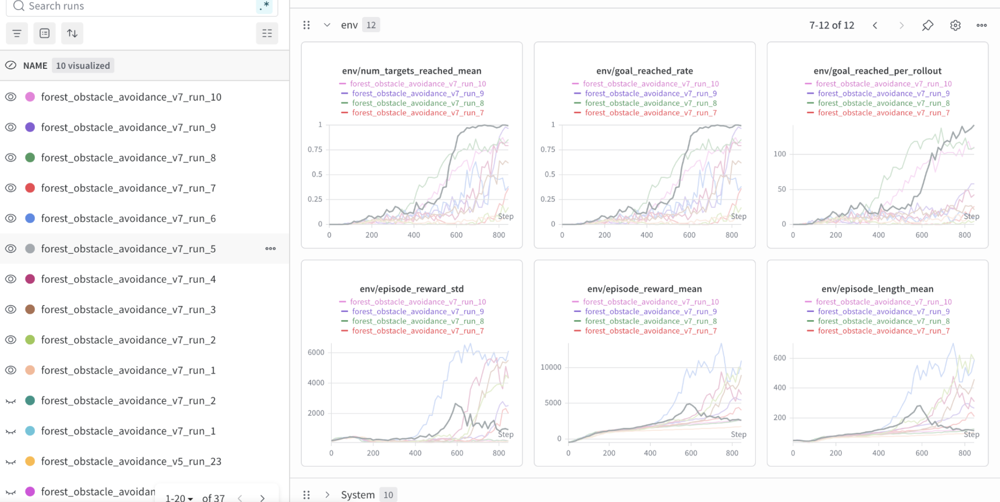
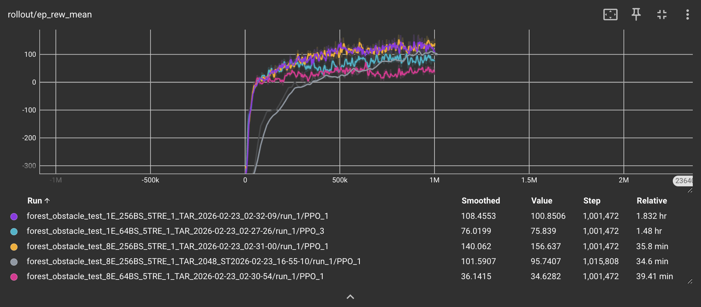
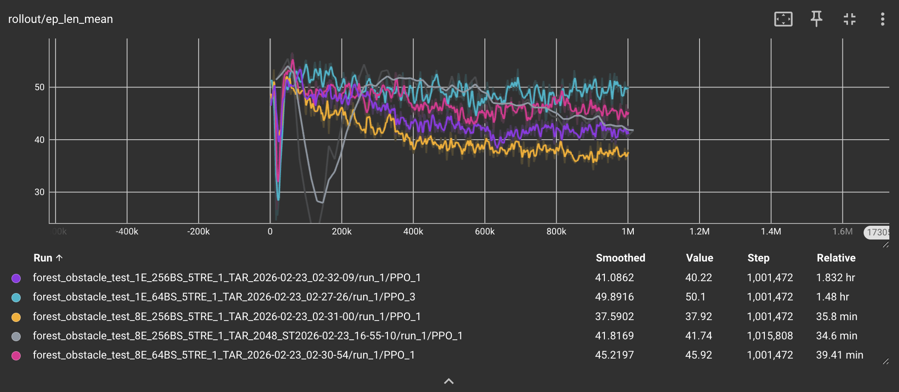
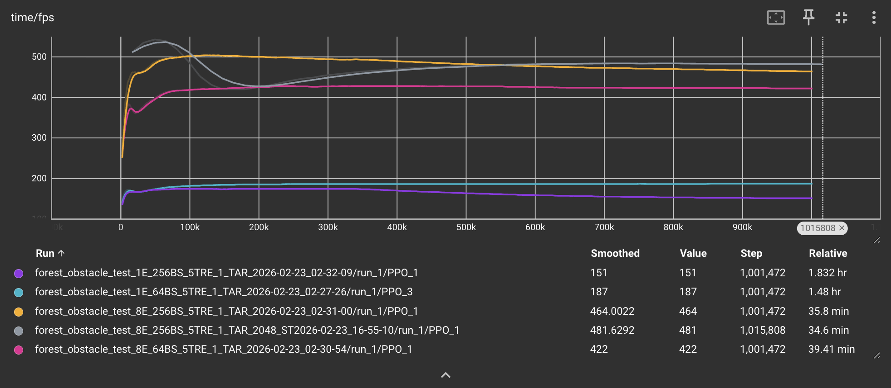
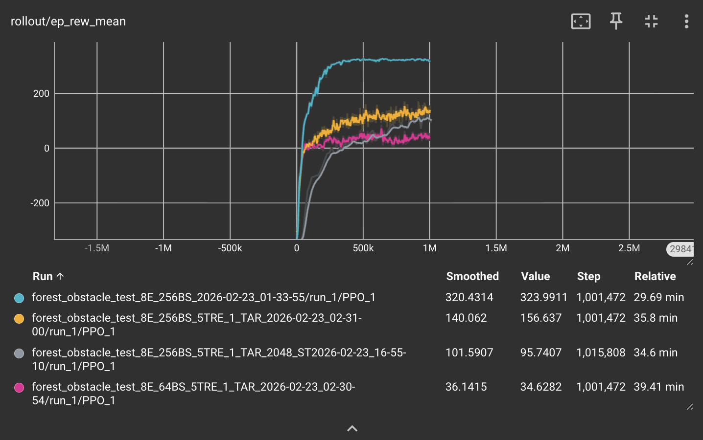
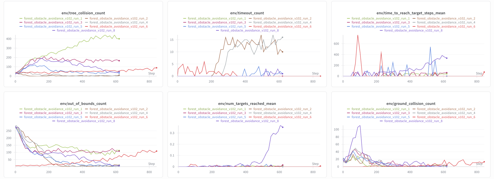
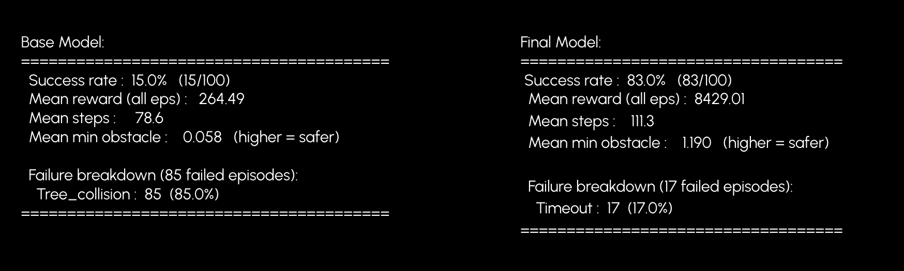

<iframe width="640" height="480" src="https://drive.google.com/file/d/1K7OqwXgI1QTIV79CIHs6YvczwFc77q1w/preview" title="Video" frameborder="0" allowfullscreen></iframe>

## Project Summary

Our project involves training an autonomous drone to fly through a simulated forest environment from a starting point to a destination point without colliding into obstacles. This problem is particularly relevant and suitable for using reinforcement learning algorithms to accomplish because such algorithms allow the drone to learn adaptive behaviors during flight that can outperform navigation achieved through manual programming and even human pilots. Additionally, conducting such training in a simulated physics environment allows us to run multiple simulations and refine our algorithm without risking physical hardware, and train the drone to succeed in a variety of simulated conditions that may be uncommon in the real world. Allowing us to solidify our drone’s performance before deploying it in real world first-responder settings is critical for missions where human bandwidth is limited and drones need to reach certain points, such as lost hikers, independently. Navigating through dense forests is challenging because the drone must continuously balance two competing objectives: reaching the goal efficiently while avoiding unpredictable obstacles. Traditional rule-based navigation systems struggle with this problem because they require manually engineered heuristics for obstacle avoidance and trajectory planning. Reinforcement learning provides a more flexible solution by allowing the drone to learn navigation policies directly from interaction with the environment, adapting to complex spatial configurations of obstacles that would be difficult to encode manually.

We accomplished this goal by using mesh models to represent realistic trees, simulated LiDAR-based observations to detect collision objects as the drone flies, tuning the reward function to be compatible with our forest environment, and the PPO reinforcement learning algorithm to train our drone. By knowing its current position, velocity, roll, pitch, yaw, angular velocity, and the position of its destination, the drone accelerates, decelerates, or turns as necessary to avoid obstacles and continue making progress towards its destination.

## Approach

### RL algorithm
To train our drone, we use the Proximal Policy Optimization (PPO) implementation from stable-baselines3. This reinforcement learning algorithm is on-policy and online, collecting information from the environment during each iteration to update the policy. By optimizing a clipped surrogate objective function, PPO constrains how much the policy changes during training, making it a stable algorithm. We chose to use PPO for the purposes of drone navigation training because it generally outperforms other algorithms like DQN in navigating complex environments and prioritizes cautious policy updates according to the paper “Comparative Analysis of DQN and PPO Algorithms in UAV Obstacle Avoidance 2D Simulation.”

For our project, we use the stablebaselines3 Multi-Layer Perceptron (MLP) Policy. We are sticking with this standard policy because we pass in a low-dimensional numeric observation. Our full observation vector comprises of 3 main categories. The first category is a fixed 8 dimension vector containing LiDAR observations from our environment. We thought the drone would learn faster with LiDAR as opposed to noisier image observations. This LiDAR is simulated as a ray-cast around the drone: the environment calculates the distance between the drone and environment objects in 8 evenly-spaced directions, these values are then passed into the PPO model. The second is the 3 dimensional target deltas, which indicate progress towards the waypoint. The third is the 21 dimensional vector for attitude, which describes the drone's linear velocity, angular velocity, and orientation. We also utilize frame stacking (2 stacks), which makes our final observation vector 64 dimensions.

We run 8 parallel environments to accelerate our training. We initially reduced the step size to keep the batch updates consistent in steps, since our simpler experiments converged faster with smaller steps sizes. However, when running it again on the more complex experiments (with trees) we realized we should go back to larger step sizes to maintain stability. We also increased the batch size from 64 to 256 to stabilize our policy updates.

The notable hyperparameters we are using for training are:
* Parallel Environments = 8
* Learning rate = 5e-4
* Rollout step size = 2048
* Batch size = 1024
* Number of epochs = 10
* Discount factor = 0.99
* Coefficient of Entropy = 0.1

Most, except batch size, learning rate, parallel environment amount, and our coefficient of entropy, are default parameters as described in the [stable-baselines3 doumentation](https://stable-baselines3.readthedocs.io/en/master/modules/ppo.html). We experimented with different configurations and decided to increase batch size to stabilize updates and improve performance. We increased our learning rate and our entropy as well, to encourage exploration and faster updates once the model finds a successful path.

We were able to efficiently determine the best set of hyperparameters by running multiple experiments in parallel on UCI’s HPC3 while utilizing Weights and Biases to test different combinations. We found that even if our drone made occasional successful moves, it would not reflect quickly in the policy. We made our learning rate larger to achieve more frequent policy updates once the drone discovered successful behavior, so it can learn the basics of flying and navigation faster during training. Our initial low coefficient of entropy of 0.01 resulted in our drone primarily moving directly towards the target instead of a less obviously optimal direction such as moving horizontally to avoid a tree. Combining these two findings, we found that an increased entropy to encourage exploration allowed our drone to discover successful flight paths quicker and react to those discoveries by updating the policy faster.

For an environment with 15 trees, below are comparisons of different combinations of hyperparameters:

The graph in grey is our best performing graph, with the hyperparameters stated above. The notable hyperparameters separating this run from the others were:
* Learning rate = 5e-4
* Coefficient of Entropy = 0.1

We train for up to 4_000_000 steps and use make_vec_env for a vectorized and parallel training environment.

From experiments earlier in the quarter, we determined that we can train our model significantly faster if we run 8 parallel environments, going from ~2 hours to ~0.5 hours.

### Waypoint and tree generation
To configure our environment, we are inheriting from PyFlyt’s QuadXWaypointsEnv class and extending it to include our forest environment, where the QuadXWaypointsEnv class already provides functionality for the drone flying towards waypoints using the Bullet physics engine. We modified the waypoint generation process to have a single waypoint spawn at a random coordinate location sampled from a specified goal region. To add trees into this environment, we used oak tree mesh models from osrf’s open-source GitHub repository for visual realism. However, for simplicity, we used cylinders as the collision shape for the trees so that we neglect the presence of leaves in our trees. The number of trees randomly spawned into the environment is configurable by a parameter that the user can change, but for our final model we used a moderately dense forest of 25 trees.

We began our project by training our drone in a simple and sparse forest environment by only spawning 5 trees. By training in a sparse forest environment, we were better able to visualize the drone’s flight trajectory, and we learned that the drone would fly in an identical, slightly curved, path to the waypoint, regardless of if a tree was in its way or not. Since this is not the behavior we wanted the drone to learn, we worked on our reward function and hyperparameter tuning to improve the stability and accuracy of the tree environment so that the drone learns to meaningfully avoid the trees in the simple environment before moving on to a denser forest of 25 trees.

### State and action space
We then modified the state space to include the distance from the drone to any surrounding obstacles, which we calculate by projecting 8 rays from the drone’s body to detect obstacles within 5 meters. This is in addition to the attitude state (measurements related to velocity, orientation, auxiliary sensor data, etc.) and target deltas (drone’s relative position to waypoints) that are already provided in the QuadXWaypointsEnv class. With frame stacking (N_Stack = 2), our state space was effectively doubled to a total size of 64 dimensions. We did not modify the action space, which currently consists of continuous values for roll rate, pitch rate, yaw rate, and thrust.

### Reward function
The reward relies on multiple components to encourage fast navigation while avoiding obstacles. The most important considerations are:
* Reward for movement towards the target waypoint: up to +5 per step
* Reward for faster velocities towards target: up to +4 per step
* Reward for arriving at goal: +100
* Time penalty to discourage slow navigation or reward farming (hovering to accumulate rewards): -0.2 per step
* Height penalty to discourage the drone from flying above trees to reach the target, which defeats the purpose of learning to navigate around tree trunks: -0.5 x height above limit
* Obstacle proximity penalty to discourage drone from flying within close range of a tree: up to -3 per step, scaled quadratically by closeness
* Collision penalty for crashing into trees or the ground, which immediately terminates the episode: -100
To get to these final rewards, we utilized a cycle where we analyzed specific metrics described in detail below, and iterated our reward function based on the issues our previous models were facing.

## Evaluation

### Quantitative metrics

At first we used the mean episode reward & mean episode length values to assess our drone’s performance. While we were working to set up our environment, we were utilizing these values to give a heuristic for our drone’s performance - higher mean values & lower episode lengths meant our drone was reaching the target sooner and more successfully. However, once we started experimenting with our reward function we realized these metrics were no longer standardized across experiments. If we altered the rewards associated with different events during training, such as proximity to target or reaching the waypoint, or penalty weights such as hitting a tree or going further from the target, comparing reward functions would no longer be a clear metric for success. Instead, we began to track metrics such as waypoints reached, timeouts, number of steps taken, and number of collisions (tree, ground, out of bounds). This gave us a consistent way to track the heuristics we cared about across runs. We wanted to maximize the waypoints reached per rollout while minimizing collisions and timeouts.

The image above is an example from early in our experiments once we switched to track more than just mean reward and episode length. We could see that our earlier iteration drones were struggling to reach the target on average (around 0.05% of the time) but with “run_8”, we saw a huge jump in the percentage of runs where the drone reached the target. During this run, we removed the proximity reward and heavily relied on a velocity reward to encourage constant movement towards the target. You can see the impact of this on the timeout count graph, where almost all other runs were experiencing some degree of timeout, but run_8 minimizes it. From there, we were able to use our model from run_8 as a baseline to continue training more capable models.

This change also addressed a qualitative issue we encountered during initial training: even though our reward graphs were consistently climbing, when we ran our trained models we saw that our drone never made the final step towards the target and would instead hover close to the target. We hypothesized that this was due to providing rewards for absolute distance to the waypoint that were disproportionate to the value of actually reaching the waypoint, leading the drone to learn that it can gain more reward by hovering close to the target and gaining proximity rewards rather than reach the waypoint and gain the reward associated with completion. By using Weights and Biases to track our experiments, we were able to quickly see that removing the proximity reward indeed led to a better performing model within the heuristics we cared about.

We evaluated our models using a script that ran a model in 100 different environments and tracked the success rate & failure modes of the model in each environment. Comparing the base model that we inherited from PyFlyt to our final model, we reached a significantly higher success rate. The only type of failure we encountered was timeouts, which may be solvable with a longer timeout threshold. This shows we were able to successfully achieve forest navigation for our drone in this simulated environment.

The above image shows that the agent learns faster with lower step sizes (2048 distributed across N envs) compared to 2048 per environment. However, the policy updates with smaller step sizes are more noisy and volatile. It also shows that using 1 vs 8 environments has less of an impact on the ultimate success of the drone compared to the batch size. Environment quantity mainly affected training time. The small batch size runs converge faster and on a lower value: we think the variance of the updates prevents them from understanding what is actually useful data versus noise.

Our graph for ep_len_mean shows a downward trend which is a positive for our setup as this indicates that our drone is learning to stay airborne longer without crashing into obstacles as colliding into a tree would immediately terminate the episode. The decreasing episode length combined with the increasing reward function provides reasonable evidence that our drone is learning to navigate to its goal location faster, rather than other explanations such as the drone immediately crashing into a tree (which would also lead to shorter episodes). This is good progress since we want our drone to not be afraid to explore and learn the forest environment, however we also do not want the drone to fly aimlessly for an excessive amount of time so we need to find a balance between exploration of the environment and efficiency in reaching the target waypoint.

The above image shows that the frames per second are wildly different between runs with 1 vs 8 environments. More frames per second means faster data collection and the possibility to run more experiments in a shorter timeframe.

### Qualitative metrics
We are visualizing our drone using the render_mode=”human” argument in our custom class inherited from QuadXWaypoints, which allows us to see the drone learning to fly through the forest environment. When we began our project by training our drone in a relatively sparse forest environment, we observed that the drone often flew in the same pattern in its route to get to the waypoint, regardless of if there’s a tree in its way or not. Since the tree placement was sparse, the drone usually got lucky and there wasn’t a tree in its way and it quickly navigated to the waypoint. However, once we started training our drone in more dense forest environments this issue became more apparent and we needed to modify the reward function, the hyperparameters, and train for more episodes.

<video width="320" height="240" controls>
  <source src="rollout.mp4" type="video/mp4">
  Your browser does not support the video tag.
</video>

This video shows an early version of our policy that uses the mesh trees with a single waypoint. Since the trees rendered outside the path of the drone, it does not encounter any obstacles and moves quickly and effectively towards the waypoint, achieving its goal of reaching it.

<iframe src="https://drive.google.com/file/d/17smqy9Ppoc2DzdVCgPO5hhhXd5vRecx9/preview"
        width="320"
        height="240"
        allow="autoplay">
</iframe>

The video shows one of our intermediate models. Although its movement is slow, it demonstrates an ability to move horizontally to avoid oncoming obstacles. This behavior is much improved than our previous models which were unable to learn this regardless of the number of steps we used to train them. We believe the driving force behind this change in behavior came from our decision to increase our entropy coefficient when training. We think that the probability of the action of moving straight towards the waypoint dominated the policy and prevented the drone from ever exploring the action of moving horizontally.

<video width="320" height="240" controls>
  <source src="images/presentation_run.mp4" type="video/mp4">
  Your browser does not support the video tag.
</video>

The video above is the final demonstration of our trained drone navigating through a dense forest environment of 25 trees. The waypoint spawns at a random location in our environment, and we track the drone’s flight pattern as it navigates towards it, avoids obstacles in its path, and finally reaches the waypoint. We can toggle between the CAD tree view and the cylindrical collision shape view to see what actually counts as a collision, as the collision shapes only model the tree trunks of the CAD models and not the leaves, meaning the drone can fly through tree leaves without it being considered a collision. This video demonstrates the success of our RL model in training a drone to fly through a forest environment and meaningfully avoid obstacles in its path, which we achieved by running and logging multiple experiments and iterations of tweaking our reward function as described above.

## Resources Used
* We are building on top of an existing library, PyFlyt. They have existing implementations of drone RL controls and waypoint navigation. We inherited this waypoints environment to develop our forest environment, which is what we use for our reward shaping, simulated LiDAR observations, and tree integration. We chose to use PyFlyt because of a paper we read (Panerati et. al.) that compared it to other existing drone environments, where it had notable advantages such as realistic collision effects and existing RL support. We also used a handful of ML sites and Youtube videos to understand hyperparameters & RL concepts.
* [Stable-Baselines3 Documentation](https://stable-baselines3.readthedocs.io/)
* [PyFlyt source code](https://github.com/jjshoots/PyFlyt)
* [Oak tree mesh model](https://github.com/osrf/gazebo_models/tree/master)
* [“Comparative Analysis of DQN and PPO Algorithms in UAV Obstacle Avoidance 2D Simulation” paper](https://ceur-ws.org/Vol-3688/paper25.pdf)
* [ "Learning to Fly—a Gym Environment with PyBullet Physics for Reinforcement Learning of Multi-agent Quadcopter Control"](https://arxiv.org/pdf/2103.02142)
* [PPO Hyperparameters](https://medium.com/aureliantactics/ppo-hyperparameters-and-ranges-6fc2d29bccbe)
* AI Tool Usage:
    * Claude / ChatGPT
        * Debugging
        * Concept summaries & pointing us to resources to investigate further
        * Discussing implementation approaches & improvements
    * Gemini
        * Finding resources to investigate topics or problem solutions further
