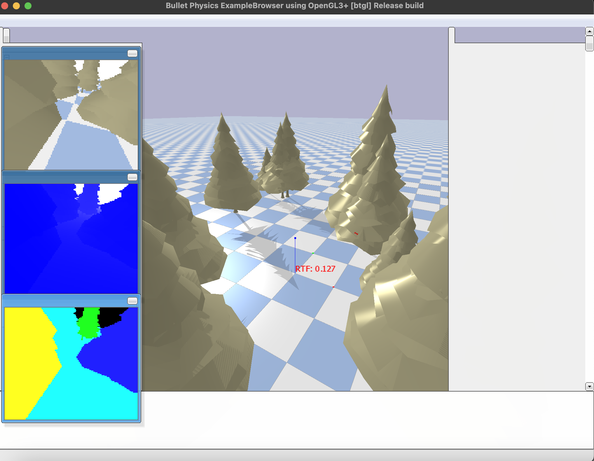

Source code: https://carol3961.github.io/quadKWPter

## Project Outline
Our project involves training an autonomous drone to fly through a simulated forest environment from a starting point to a destination point without colliding into obstacles. We will accomplish this by using mesh models to represent realistic trees, LiDAR to detect collision objects as the drone flies, tuning the reward function to be compatible with our forest environment, and the PPO reinforcement learning algorithm to train our drone.

{: style="width:50%; height:50%;"}

Reports:

- [Proposal](proposal.html)
- [Status](status.html)
- [Final](final.html)

## Sources
* [Our GitHub repo](https://github.com/carol3961/quadKWPter/tree/main)
* [PyFlyt source code](https://github.com/jjshoots/PyFlyt)
* [Oak tree mesh model](https://github.com/osrf/gazebo_models/tree/master)
* [“Comparative Analysis of DQN and PPO Algorithms in UAV Obstacle Avoidance 2D Simulation” paper](https://ceur-ws.org/Vol-3688/paper25.pdf)
* ["Learning to Fly—a Gym Environment with PyBullet Physics for Reinforcement Learning of Multi-agent Quadcopter Control"](https://arxiv.org/pdf/2103.02142)

[quickref]: https://github.com/mundimark/quickrefs/blob/master/HTML.md
