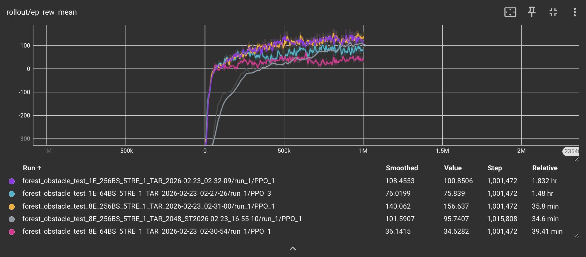
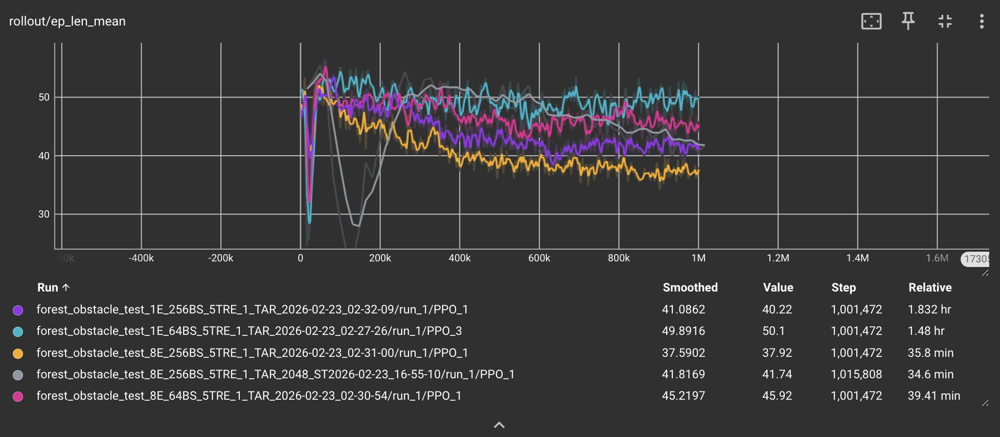
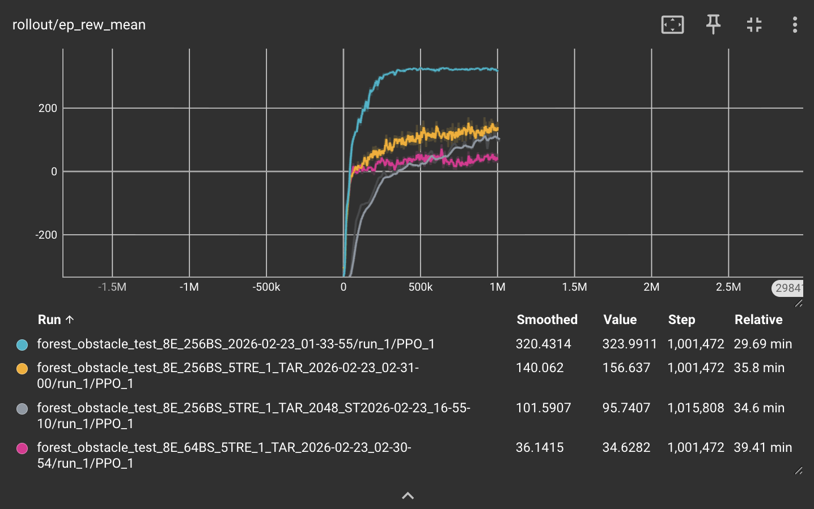

## Project Summary

Our project involves training an autonomous drone to fly through a simulated forest environment from a starting point to a destination point without colliding into obstacles. We will accomplish this by using mesh models to represent realistic trees, LiDAR to detect collision objects as the drone flies, tuning the reward function to be compatible with our forest environment, and the PPO reinforcement learning algorithm to train our drone. By knowing its current position, velocity, roll, pitch, yaw, angular velocity, and the position of its destination, the drone will accelerate, decelerate, or turn as necessary to avoid obstacles and continue making progress towards its destination.

## Approach

### RL algorithm
To train our drone, we are using the PPO implementation from stable-baselines3, a reinforcement learning algorithm that collects information from the environment during each iteration to update the policy. By optimizing a clipped surrogate objective function, PPO constrains how much the policy changes during training, making it a stable algorithm. We chose to use PPO for the purposes of drone navigation training because it generally outperforms other algorithms like DQN in navigating complex environments and prioritizes cautious policy updates according to the paper “Comparative Analysis of DQN and PPO Algorithms in UAV Obstacle Avoidance 2D Simulation.” We run this in parallel in 8 environments to accelerate our training. We reduce the step size to keep the batch updates consistent in steps, since when we scale up environments we get more steps per update unless we reduce the rollout step size. We also increased the batch size from 64 to 256 so the learner has more stable policy updates.

The notable hyperparameters we are using for training are:
* Parallel Environments = 8
* Learning rate = 3e-4
* Rollout step size = 2048 // Num_envs
* Batch size = 256
* Number of epochs = 10
* Discount factor = 0.99

We are currently training for 1,000,000 timesteps using make_vec_env for a vectorized and parallel training environment.

For an environment with 5 trees, below are comparisons of different combinations of hyperparameters:

The above image shows that the agent learns faster with lower step sizes (2048 distributed across N envs) compared to 2048 per environment. However, the policy updates with smaller step sizes are more noisy and volatile. It also shows that using 1 vs 8 environments has less of an impact on the ultimate success of the drone compared to the batch size. Environment quantity mainly affected training time. The small batch size runs converge faster and on a lower value: we think the variance of the updates prevents them from understanding what is actually useful data versus noise.

The above image shows that the length of the episodes are slowly decreasing over time. This may be because the agents are beginning to be more confident in their actions, and are learning to reach the goal faster. Since it's an average, episodes could also be ending sooner because the drone may crash more often if it becomes overconfident in a wrong policy.

The above image shows that the frames per second are wildly different between runs with 1 vs 8 environments. More frames per second means faster data collection and the possibility to run more experiments in a shorter timeframe.

These graphs show how our training time goes down from ~2 hours to ~0.5 hours just from running 8 parallel environments.

### Waypoint and tree generation
To configure our environment, we are inheriting from PyFlyt’s QuadXWaypointsEnv class and extending it to include our forest environment, where the QuadXWaypointsEnv class already provides functionality for the drone flying towards waypoints using the PyBullet engine. We modified the waypoint generation process to have a single waypoint spawn at a random coordinate location sampled from a specified goal region. To add trees into this environment, we used oak tree mesh models from osrf’s open-source GitHub repository for visual realism. However, for simplicity, we used cylinders as the collision shape for the trees so that we neglect the presence of leaves in our trees. The number of trees randomly spawned into the environment is configurable by a parameter that the user can change, however for our preliminary training we chose to use small numbers like 5 and 10 trees.

Moving from no trees to 5 trees significantly affected our drone's ability to find a successful policy. After 1 million steps, the 5 tree environment appears to converge to a lower average reward than when there were no trees present. This is reflected when we run the model file, and we see that the drone often flies directly into the trees and the episode ends. However, because the trees spawn in random locations sometimes it luckily avoids the trees.

We need to work on our reward functions or hyperparameter tuning to improve the stability and accuracy of the tree environment, so that the drone learns to avoid the trees instead of accepinting a lower reward ceiling.

### State and action space
We then modified the state space to include the distance from the drone to any surrounding obstacles, which we calculate by projecting rays from the drone’s body to detect obstacles within a certain radius. This is in addition to the attitude state (measurements related to velocity, orientation, auxiliary sensor data, etc.) and target deltas (drone’s relative position to waypoints) that are already provided in the QuadXWaypointsEnv class. We did not modify the action space, which currently consists of continuous values for roll rate, pitch rate, yaw rate, and thrust.

### Reward function
The reward relies on multiple components to encourage fast navigation while avoiding obstacles. The most important considerations are:
* Substantial reward for movement towards the target waypoint
* Minimal time penalty to encourage faster navigation
* Collision penalty for crashing into trees, which immediately terminates the episode
* Height penalty to discourage flying above trees to reach the target
* Obstacle proximity penalty if drone flies within close range of a tree

## Evaluation

### Quantitative metrics
Fill in...

### Qualitative metrics
We are visualizing our drone train using the render_mode=”human” argument in our custom class inherited from QuadXWaypoints which allows us to see the drone learning to fly through the forest environment. Because we are training our drone in a relatively sparse forest environment currently, we observe that the drone is often flying the same pattern in its route to get to the waypoint, regardless of if there’s a tree in its way or not. Since the tree placement is sparse, the drone usually gets lucky and there isn’t a tree in its way and it quickly navigates to the waypoint, but once we start training our drone in more dense forest environments we expect to encounter more issues with navigation and will need to modify the reward function, the hyperparameters, and train for more episodes.

## Remaining Goals and Challenges

For the remainder of the quarter we hope to make our forest environment more robust to allow the drone to learn to fly through more complicated and realistic forest scenarios. After increasing the density of trees, we anticipate having to tune our hyperparameters for PPO, refine the reward function, and train for longer episodes as the environment will be a lot more complex. We anticipate tuning the reward function to be an obstacle as we don’t want our agent to learn to maximize rewards by avoiding the intended behavior. For example, an issue we already noticed was that the drone was learning to fly above the trees to navigate to the target, which defeats the purpose of detecting and avoiding trees. To combat this we issued a penalty for when the drone flies too high above the target which helped correct its behavior. When we introduce a more complex forest environment we anticipate the drone to learn other shortcuts that are not conducive to real learning and we will have to adjust our implementation accordingly.

## Resources Used
* We are using AI chatbots to help debug our code
* [PyFlyt source code](https://github.com/jjshoots/PyFlyt)
* [Oak tree mesh model](https://github.com/osrf/gazebo_models/tree/master)
* [“Comparative Analysis of DQN and PPO Algorithms in UAV Obstacle Avoidance 2D Simulation” paper](https://ceur-ws.org/Vol-3688/paper25.pdf)
