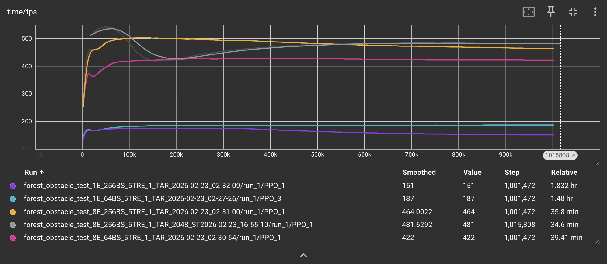

<iframe width="640" height="480" src="https://www.youtube.com/embed/Hd_muOGjCrA" title="Video" frameborder="0" allowfullscreen></iframe>

## Project Summary

Our project involves training an autonomous drone to fly through a simulated forest environment from a starting point to a destination point without colliding into obstacles. We will accomplish this by using mesh models to represent realistic trees, LiDAR to detect collision objects as the drone flies, tuning the reward function to be compatible with our forest environment, and the PPO reinforcement learning algorithm to train our drone. By knowing its current position, velocity, roll, pitch, yaw, angular velocity, and the position of its destination, the drone will accelerate, decelerate, or turn as necessary to avoid obstacles and continue making progress towards its destination.

## Approach

### RL algorithm
To train our drone, we are using the PPO implementation from stable-baselines3, a reinforcement learning algorithm that collects information from the environment during each iteration to update the policy. By optimizing a clipped surrogate objective function, PPO constrains how much the policy changes during training, making it a stable algorithm. We chose to use PPO for the purposes of drone navigation training because it generally outperforms other algorithms like DQN in navigating complex environments and prioritizes cautious policy updates according to the paper “Comparative Analysis of DQN and PPO Algorithms in UAV Obstacle Avoidance 2D Simulation.”

For our project, we use the stablebaselines3 Multi-Layer Perceptron (MLP) Policy. We are sticking with this standard policy because we pass in a low-dimensional numeric observation - a fixed 8 dimension vector containing LiDAR observations from our environment. We thought the drone would learn faster with LiDAR as opposed to noisier image observations. This LiDAR is simulated as a ray-cast around the drone: the environment calculates the distance between the drone and environment objects in 8 evenly-spaced directions, these values are then passed into the PPO model.

This 8 dimension vector is part of our full observation vector, which is comprised of 3 main categories. The first category is the 8 dimension vector we just mentioned above. The second is the 3 dimensional target deltas, which indicate progress towards the waypoint. The third is the 12 dimensional vector for attitude, which describe the drone's linear velocity, angular velocity, and orientation. This makes our full observation vector 23 dimensions. 

We run 8 parallel environments to accelerate our training. We initially reduced the step size to keep the batch updates consistent in steps, since our simpler experiments converged faster with smaller steps sizes. However, when running it again on the more complex experiments (with trees) we realized we should go back to larger step sizes to maintain stability. We also increased the batch size from 64 to 256 to stabilize our policy updates.

The notable hyperparameters we are using for training are:
* Parallel Environments = 8
* Learning rate = 3e-4
* Rollout step size = 2048
* Batch size = 256
* Number of epochs = 10
* Discount factor = 0.99

Most, except batch size, are default parameters as described in the [stable-baselines3 doumentation](https://stable-baselines3.readthedocs.io/en/master/modules/ppo.html). We experimented with different configurations and decided to increase batch size to stabilize updates and improve performance, as seen in the Quantitative Metrics section below. We plan to integrate Weights and Biases to continue experimenting with different configurations going forward, in a more standardized way.

We are currently training for 1,000,000 timesteps using make_vec_env for a vectorized and parallel training environment.

For an environment with 5 trees, below are comparisons of different combinations of hyperparameters:

These graphs show how our training time goes down from ~2 hours to ~0.5 hours just from running 8 parallel environments.

### Waypoint and tree generation
To configure our environment, we are inheriting from PyFlyt’s QuadXWaypointsEnv class and extending it to include our forest environment, where the QuadXWaypointsEnv class already provides functionality for the drone flying towards waypoints using the PyBullet engine. We modified the waypoint generation process to have a single waypoint spawn at a random coordinate location sampled from a specified goal region. To add trees into this environment, we used oak tree mesh models from osrf’s open-source GitHub repository for visual realism. However, for simplicity, we used cylinders as the collision shape for the trees so that we neglect the presence of leaves in our trees. The number of trees randomly spawned into the environment is configurable by a parameter that the user can change, however for our preliminary training we chose to use small numbers like 5 and 10 trees.

Moving from no trees to 5 trees significantly affected our drone's ability to find a successful policy. After 1 million steps, the 5 tree environment appears to converge to a lower average reward than when there were no trees present. This is reflected when we run the model file, and we see that the drone often flies directly into the trees and the episode ends. However, because the trees spawn in random locations sometimes it luckily avoids the trees.

We need to work on our reward functions or hyperparameter tuning to improve the stability and accuracy of the tree environment, so that the drone learns to avoid the trees instead of accepting a lower reward ceiling.

### State and action space
We then modified the state space to include the distance from the drone to any surrounding obstacles, which we calculate by projecting rays from the drone’s body to detect obstacles within a certain radius. This is in addition to the attitude state (measurements related to velocity, orientation, auxiliary sensor data, etc.) and target deltas (drone’s relative position to waypoints) that are already provided in the QuadXWaypointsEnv class. We did not modify the action space, which currently consists of continuous values for roll rate, pitch rate, yaw rate, and thrust.

### Reward function
The reward relies on multiple components to encourage fast navigation while avoiding obstacles. The most important considerations are:
* Substantial reward for movement towards the target waypoint
* Minimal time penalty to encourage faster navigation
* Collision penalty for crashing into trees, which immediately terminates the episode
* Height penalty to discourage flying above trees to reach the target
* Obstacle proximity penalty if drone flies within close range of a tree

## Evaluation

### Quantitative metrics

We are assessing our drone’s performance qualitatively using the graphs for mean episode reward (ep_rew_mean) and mean episode length (ep_len_mean). The ep_rew_mean graph shows an upwards trend, which is a good sign as it means our drone is getting better at navigating to the target waypoint at a faster speed, as we currently assign rewards depending on how close the drone is to the target and we penalize the drone for each timestep it takes to reach the goal. As the reward values are generally increasing, it means our drone is making meaningful progress in its learning task.

The above image shows that the agent learns faster with lower step sizes (2048 distributed across N envs) compared to 2048 per environment. However, the policy updates with smaller step sizes are more noisy and volatile. It also shows that using 1 vs 8 environments has less of an impact on the ultimate success of the drone compared to the batch size. Environment quantity mainly affected training time. The small batch size runs converge faster and on a lower value: we think the variance of the updates prevents them from understanding what is actually useful data versus noise.

Our graph for ep_len_mean shows a downward trend which is a positive for our setup as this indicates that our drone is learning to stay airborne longer without crashing into obstacles as colliding into a tree would immediately terminate the episode. The decreasing episode length combined with the increasing reward function provides reasonable evidence that our drone is learning to navigate to its goal location faster, rather than other explanations such as the drone immediately crashing into a tree (which would also lead to shorter episodes). This is good progress since we want our drone to not be afraid to explore and learn the forest environment, however we also do not want the drone to fly aimlessly for an excessive amount of time so we need to find a balance between exploration of the environment and efficiency in reaching the target waypoint.

The above image shows that the frames per second are wildly different between runs with 1 vs 8 environments. More frames per second means faster data collection and the possibility to run more experiments in a shorter timeframe.

Moving forwards, we are also hoping to start tracking succecss rate, collision rate, average distance to target, and comparisons across tree densities.

### Qualitative metrics
We are visualizing our drone train using the render_mode=”human” argument in our custom class inherited from QuadXWaypoints which allows us to see the drone learning to fly through the forest environment. Because we are training our drone in a relatively sparse forest environment currently, we observe that the drone is often flying the same pattern in its route to get to the waypoint, regardless of if there’s a tree in its way or not. Since the tree placement is sparse, the drone usually gets lucky and there isn’t a tree in its way and it quickly navigates to the waypoint, but once we start training our drone in more dense forest environments we expect to encounter more issues with navigation and will need to modify the reward function, the hyperparameters, and train for more episodes.

<video width="320" height="240" controls>
  <source src="images/rollout.mp4" type="video/mp4">
  Your browser does not support the video tag.
</video>
This video shows a version of our policy that uses the mesh trees with a single waypoint. Since the trees rendered outside the path of the drone, it does not encounter any obstacles and moves quickly and effectively towards the waypoint, achieving its goal of reaching it.

<iframe src="https://drive.google.com/file/d/FILE_ID/preview"
        width="320"
        height="240"
        allow="autoplay">
</iframe>
The video shows one of our more updated models. Although it's movement is slow, it demonstrates an ability to move horizontally to avoid oncomming obstacles. This behavior is much improved than our previous models which were unable to learn this regardless of the number of steps we used to train them. We believe the driving force behind this change in behavior came from our decision to increase our entropy coefficient when training. We think that the probability of the action of moving straight towards the waypoint dominated the policy and prevented the drone from ever exploring the action of moving horizontally. 

## Remaining Goals and Challenges

For the remainder of the quarter we hope to make our forest environment more robust to allow the drone to learn to fly through more complicated and realistic forest scenarios. After increasing the density of trees and incorporating the mesh trees into our main training loop, we anticipate having to tune our hyperparameters for PPO, refine the reward function, and train for longer episodes as the environment will be a lot more complex. We anticipate tuning the reward function to be an obstacle as we don’t want our agent to learn to maximize rewards by avoiding intended behavior. For example, an issue we already noticed was that the drone was learning to fly above the trees to navigate to the target, which defeats the purpose of detecting and avoiding trees. To combat this we issued a penalty for when the drone flies too high above the target which helped correct its behavior. When we introduce a more complex forest environment we anticipate the drone to learn other shortcuts that are not conducive to real learning and we will have to adjust our implementation accordingly.
To standardize our experiment tracking going forward, we want to incorporate Weights and Biases to track hyperparameter settings, as we learned different configurations can have substantial impacts on the performance of our drone.

Challenges we are anticipating include smooth integration of different development branches, as this has been an issue already. Sometimes we develop diverging branches with difficult merges, resulting in time-consuming rework of existing implementations. We also anticipate adding wind to be a challenge, since we are already encountering difficulties with tuning rewards to have our drone to effectively navigate through randomly-generated trees. Tracking all the changes between experiments will also be a challenge, which is why we look to more standardized tools.

## Resources Used
* We are utilizing an existing library, PyFlyt, to build off of. They have existing implementations of drone RL controls and waypoint navigation. We inherited this waypoints environment to develop our forest environment, which is what we use for our reward shaping, simulated LiDAR observations, and tree integration. We chose to use PyFlyt because of a paper we read (Panerati et. al.) that compared it to other existing drone environments, where it had notable advantages such as realisitc collision effects and existing RL support. We also used a handful of ML sites and Youtube videos to understand hyperparameters & RL concepts.
* [PyFlyt source code](https://github.com/jjshoots/PyFlyt)
* [Oak tree mesh model](https://github.com/osrf/gazebo_models/tree/master)
* [“Comparative Analysis of DQN and PPO Algorithms in UAV Obstacle Avoidance 2D Simulation” paper](https://ceur-ws.org/Vol-3688/paper25.pdf)
* [ "Learning to Fly—a Gym Environment with PyBullet Physics for Reinforcement Learning of Multi-agent Quadcopter Control"](https://arxiv.org/pdf/2103.02142)
* [PPO Hyperparameters](https://medium.com/aureliantactics/ppo-hyperparameters-and-ranges-6fc2d29bccbe)
* AI Tool Usage:
    * Claude / ChatGPT
        * Debugging
        * Concept summaries & pointing us to resources to investigate further
        * Discussing implementation approaches & improvements
    * Gemini
        * Finding resources to investigate topics or problem solutions further

